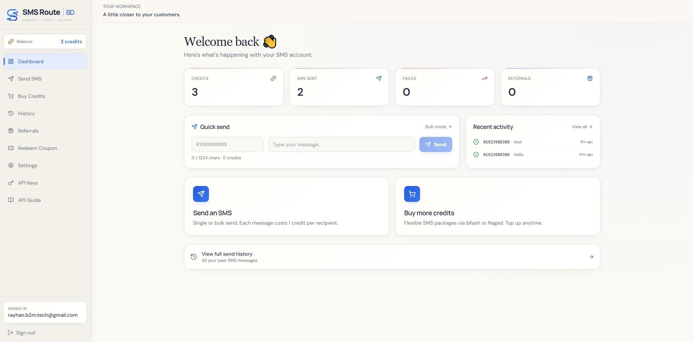

# 🌐 Landing Page Collections

A curated collection of modern, responsive, and production-ready landing pages and web dashboards built with **HTML5**, **Tailwind CSS**, and **JavaScript**.

🔗 **Live Showcase:** [https://rayhanalshorif133.github.io/landing-page-collections/](https://rayhanalshorif133.github.io/landing-page-collections/)

---

## 🚀 Live Projects & Landing Pages

| Project Name | Category | Tech Stack | Live Demo |
| :--- | :--- | :--- | :--- |
| **SMS Route BD** | SaaS / Admin Dashboard | Tailwind CSS, Lucide Icons, JS | [🔗 View Live Demo](https://rayhanalshorif133.github.io/landing-page-collections/Bulk-SMS/) |
| **Dr. Afroza Supti Roster** | Medical / Calendar Dashboard | Tailwind CSS, Plus Jakarta Sans, JS | [🔗 View Live Demo](https://rayhanalshorif133.github.io/landing-page-collections/Dr-Supti/) |

---

## 📌 Detailed Overview of Landing Pages

### 1. 📱 SMS Route BD — Bulk SMS Gateway & Dashboard
A complete web application UI & dashboard built for a Bulk SMS service provider in Bangladesh. Includes multiple pages for SMS marketing, API management, and billing.

- **Live URL:** [https://rayhanalshorif133.github.io/landing-page-collections/Bulk-SMS/](https://rayhanalshorif133.github.io/landing-page-collections/Bulk-SMS/)
- **Folder:** [`Bulk-SMS/`](./Bulk-SMS/)
- **Key Features:**
  - 📊 **Interactive Dashboard:** Real-time analytics, SMS credit counters, and recent activity feed.
  - ✉️ **Send SMS Portal:** Single and bulk SMS sending interface with character counter and template selector.
  - 📜 **SMS History & Logs:** Delivery status tracking, search, and filtering options.
  - 💳 **Billing & Credits:** Plan selector, payment gateways integration mockup, and coupon redemption.
  - 🔑 **Developer API Section:** API key generator and API documentation guide.
  - 📱 **Fully Responsive:** Drawer navigation on mobile, modern desktop sidebar.
  - 🎨 **Typography & Design:** Styled with Tailwind CSS, DM Sans & Manrope fonts, and Lucide icons.

<p align="center">
  
</p>

---

### 2. 🩺 Dr. Afroza Supti — Duty Calendar & Roster
A clean, specialized duty calendar and portfolio dashboard for medical professionals, featuring monthly shift schedules and roster tracking.

- **Live URL:** [https://rayhanalshorif133.github.io/landing-page-collections/Dr-Supti/](https://rayhanalshorif133.github.io/landing-page-collections/Dr-Supti/)
- **Folder:** [`Dr-Supti/`](./Dr-Supti/)
- **Key Features:**
  - 📅 **Dual View Modes:** Toggle seamlessly between **Grid View** (interactive calendar) and **List / Agenda View**.
  - 🏷️ **Smart Filters:** Filter shifts by **All (31)**, **☀️ Day Shifts (10)**, **🌙 Night Shifts (7)**, or **🏖️ Off Days (14)**.
  - 📈 **KPI Shift Counter:** Instant breakdown of total duties, day shifts, night shifts, and off-days.
  - 🖨️ **Print-Ready Styles:** Dedicated print styling (`@media print`) for clean physical hardcopy printing.
  - 📞 **Direct Contact Integration:** Quick-action call button and doctor profile info card.
  - 🎨 **Modern UI:** Built using Tailwind CSS, Plus Jakarta Sans, and JetBrains Mono fonts.

---

## 📂 Project Directory Structure

```text
landing-page-collections/
├── Bulk-SMS/                     # SMS Gateway & Dashboard project
│   ├── assets/
│   │   ├── css/style.css
│   │   └── js/main.js
│   ├── api-guide.html            # API Documentation
│   ├── api-keys.html             # API Keys Management
│   ├── buy-credits.html          # SMS Credit Purchase
│   ├── demo.png                  # Project Screenshot
│   ├── font-demo.png             # Font Showcase
│   ├── history.html              # SMS Delivery Logs
│   ├── index.html                # Main Dashboard
│   ├── login.html                # User Login Page
│   ├── redeem-coupon.html        # Coupon Redemption
│   ├── referrals.html            # Affiliate / Referral Program
│   ├── send-sms.html             # SMS Campaign Dispatcher
│   └── settings.html             # Account Settings
│
├── Dr-Supti/                     # Medical Duty Calendar & Roster
│   └── index.html                # Doctor Roster Dashboard
│
├── index.html                    # Root Showcase Portal
└── README.md                     # Repository Documentation
```

---

## 🛠️ Built With

- **HTML5 & CSS3** — Semantic structure and custom styling.
- **Tailwind CSS** — Utility-first CSS framework for rapid and modern UI design.
- **Vanilla JavaScript** — Lightweight, high-performance interactions without unnecessary frameworks.
- **Lucide Icons & SVG** — Clean, scalable iconography.
- **Google Fonts** — Modern typography (`DM Sans`, `Manrope`, `Plus Jakarta Sans`, `JetBrains Mono`).

---

## 💻 Running Locally

To run these landing pages locally on your machine:

1. **Clone the repository:**
   ```bash
   git clone https://github.com/rayhanalshorif133/landing-page-collections.git
   ```

2. **Navigate into the project directory:**
   ```bash
   cd landing-page-collections
   ```

3. **Open any page in your browser:**
   - Double click `index.html` or any file inside `Bulk-SMS/` or `Dr-Supti/`.
   - Or run a lightweight local server (e.g. using VS Code **Live Server** extension or Python):
     ```bash
     python -m http.server 8000
     ```
     Then open `http://localhost:8000` in your web browser.

---

## 👤 Author

**Rayhan Al Shorif**
- GitHub: [@rayhanalshorif133](https://github.com/rayhanalshorif133)
- Live Site: [Landing Page Collections](https://rayhanalshorif133.github.io/landing-page-collections/)

---

## 📄 License

This repository is licensed under the [MIT License](LICENSE). Feel free to use and adapt these designs for your personal or commercial projects.
